# Lamsa_Makeup_Store
Online makeup store.


## Team Members

| Name | Student ID |
|------|-----------:|
| Rogia Ahmed Abdeljalil | 21-618 |
| Aliaa Alislam Abbas | 21-623 |
| Nasreen Saleh Ahmed | 18-669 |

---

# Project Overview

LAMSA Beauty is a modern web-based makeup store developed as the course project for **Application Programming 2**. The system provides users with an easy and responsive shopping experience, allowing them to browse beauty products, search by product name, filter by category, and manage their shopping cart.

The project follows the **Model-View-Template (MVT)** architecture using the Django framework, ensuring clean code organization and maintainability. Product information is stored in a relational database, and the application supports authentication, authorization, and CRUD operations.

---

# Features

* User Registration (Sign Up)
* User Login and Logout
* Browse makeup products
* Search products instantly
* Filter products by category
* Product details
* Shopping cart management
* CRUD operations for products
* Responsive user interface
* Server-side form validation

---

# Technologies Used

* **Framework:** Django
* **Programming Language:** Python
* **Database:** SQLite
* **Frontend:** HTML5, CSS3, JavaScript
* **CSS Framework:** Tailwind CSS
* **Icons:** Lucide Icons

---

# Database

The application uses a relational SQLite database.

Main entities include:

* User
* Product
* Category
* Cart

Relationships:

* One Category → Many Products
* One User → One Shopping Cart
* One Cart → Many Products

---

# System Architecture

The project follows Django's **MVT (Model–View–Template)** architecture.

* **Models:** Store application data.
* **Views:** Handle requests and business logic.
* **Templates:** Display the user interface.

---

# Installation

Clone the repository:

```bash
git clone <https://github.com/rogiaa946-cyber/Lamsa_Makeup_Store.git>
```

Create a virtual environment:

```bash
python -m venv venv
```

Activate the environment.

Install dependencies:

```bash
pip install -r requirements.txt
```

Run migrations:

```bash
python manage.py migrate
```

Start the development server:

```bash
python manage.py runserver
```

Open:

```
http://127.0.0.1:8000/
```

---

# Screenshots


### Home Page

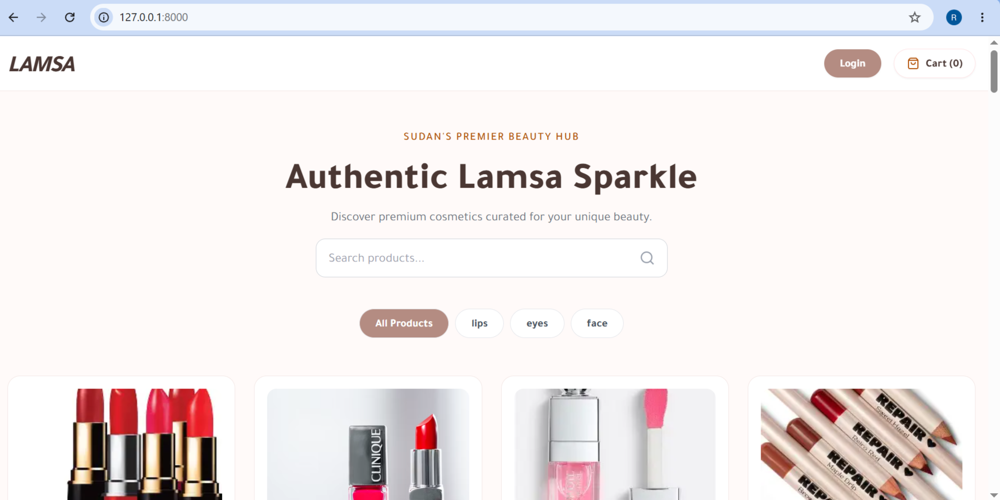

### Login Page

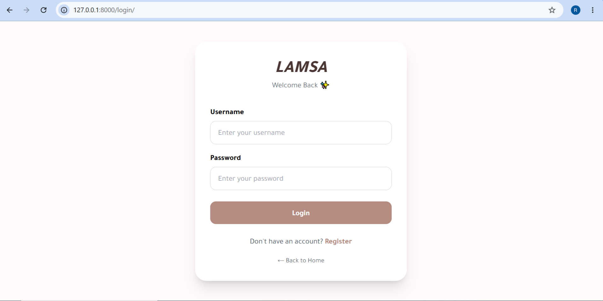

### Singup Page

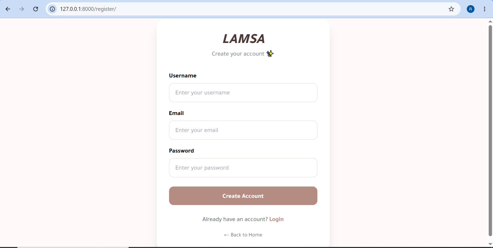

### Product List

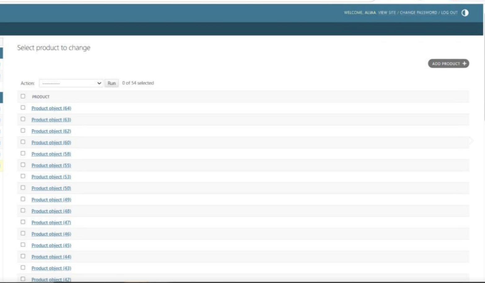

### Add Product (CRUD)

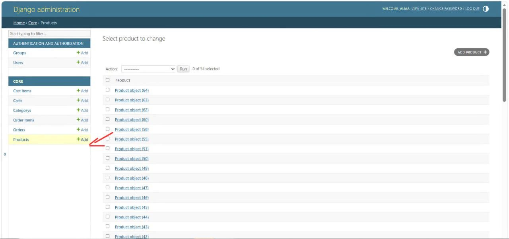

### Update Product

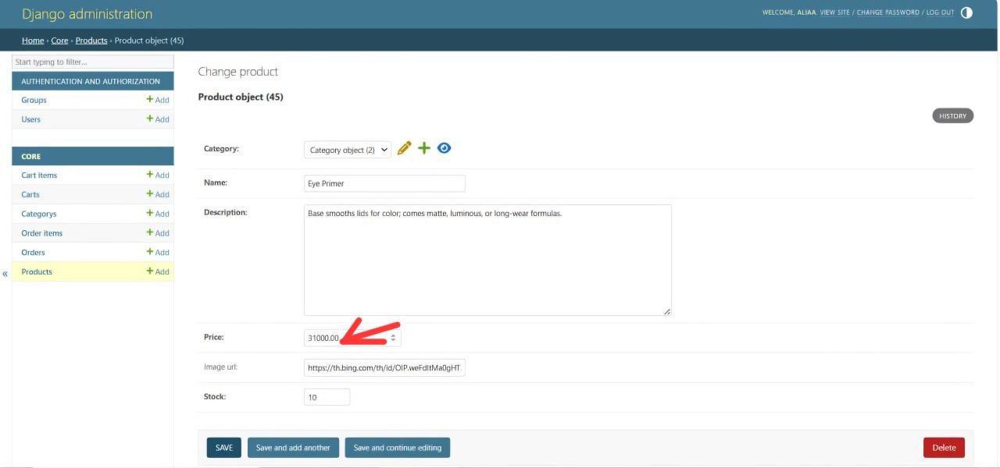

### Delete Product

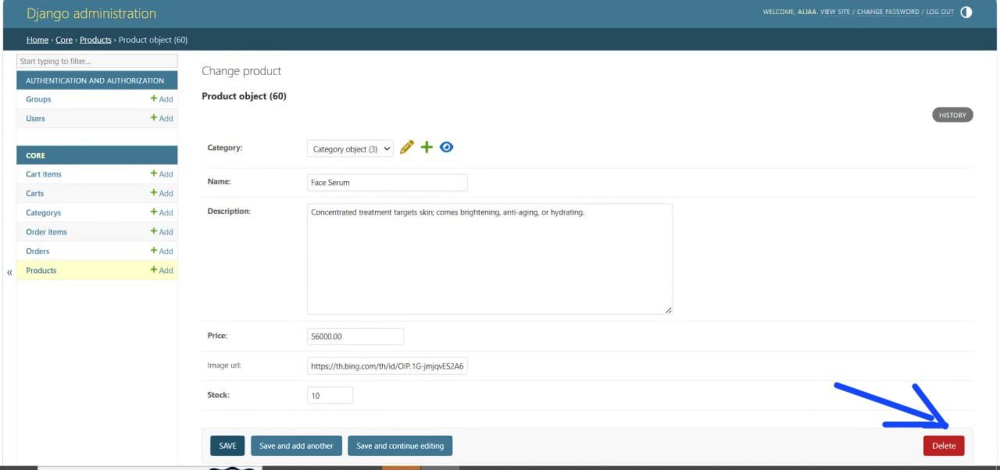

### Add Category

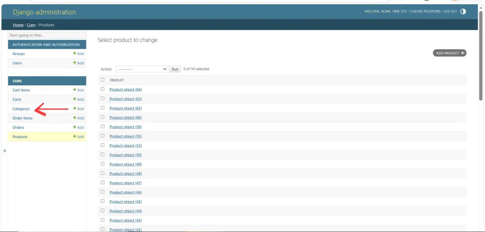

### Search Products

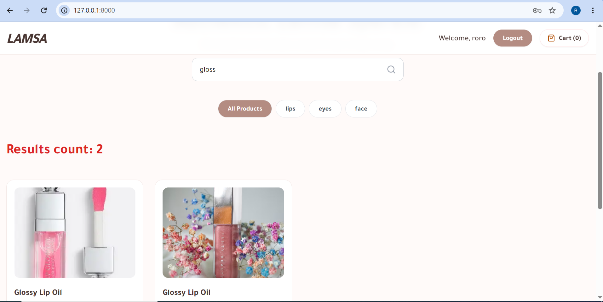


### Shopping Cart

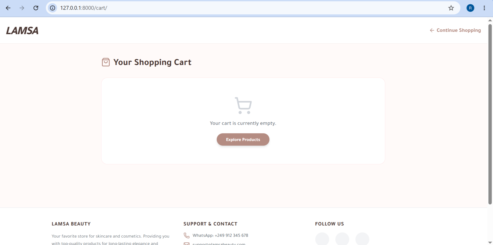

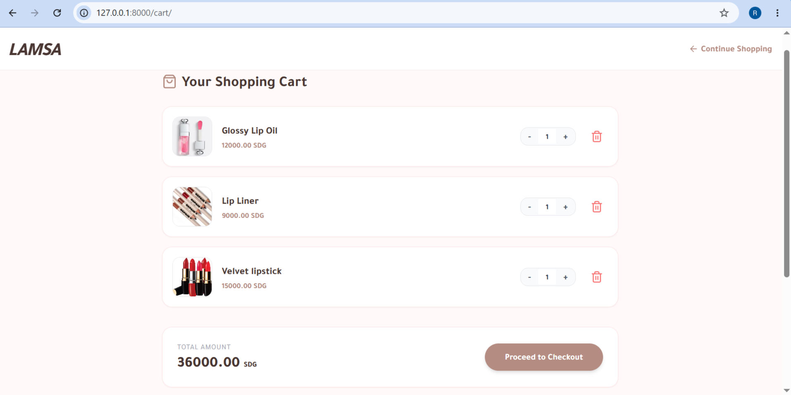

### Checkout

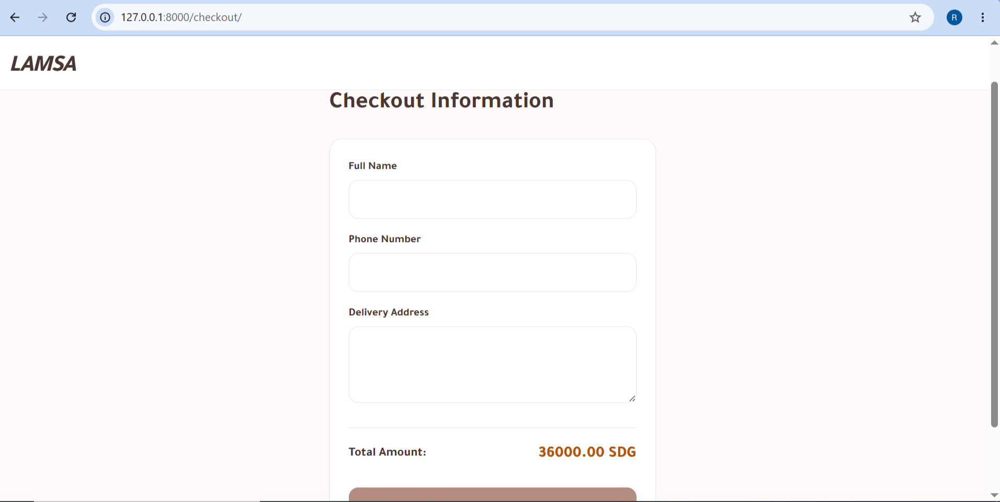

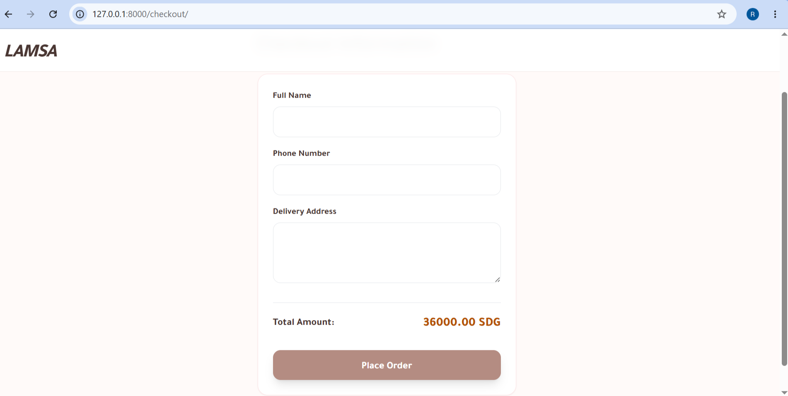

### Checkout Sucesse

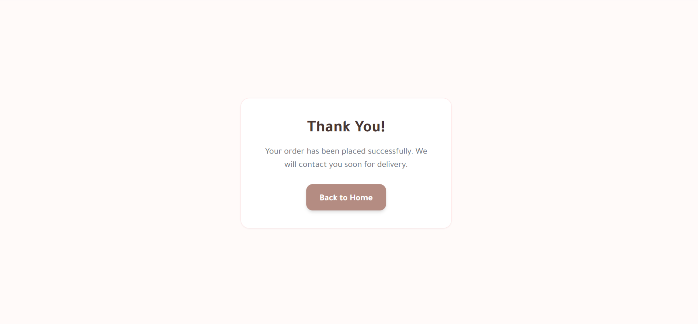

---

# Project Structure

```test
LAMSA/
│
├── core/
├── templates/
├── static/
│   ├── css/
│   ├── js/
│   └── images/
├── db.sqlite3
├── manage.py
├── requirements.txt
├── README.md
└── screenshoots
```

